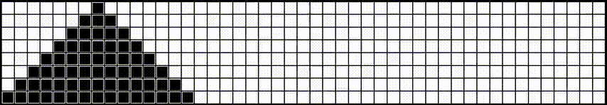

Ханойская башня
===============
Программа демонстрирует решение задачи
ханойской башни.

Управление:
* S - запускает/останавливает алгоритм
* R - приводит башню в начальное состояние

Демонстрация:

